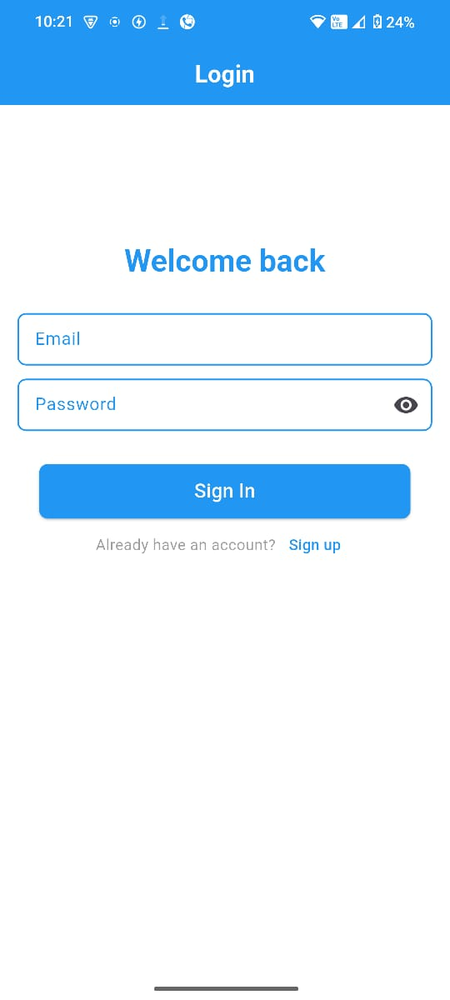
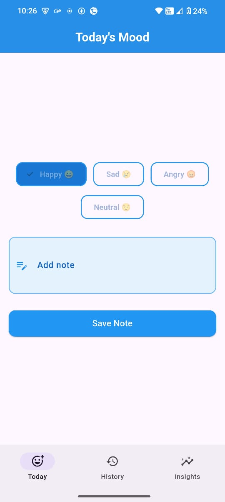
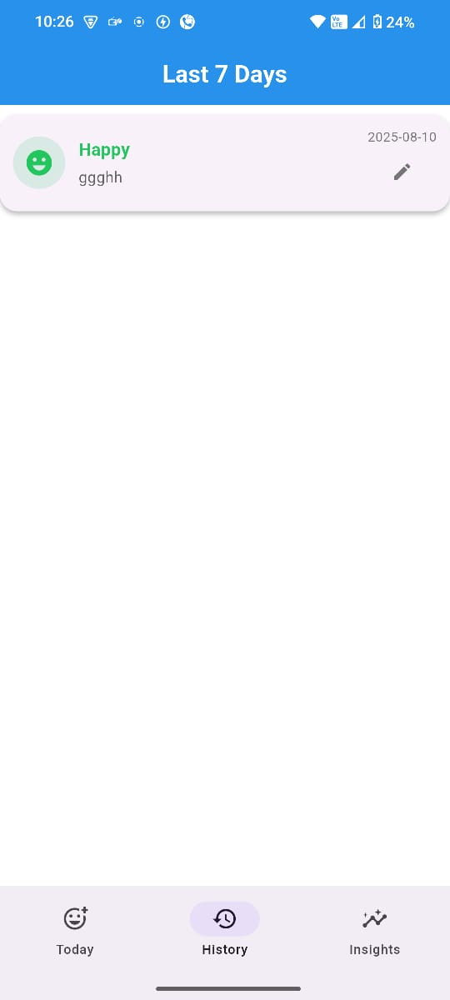
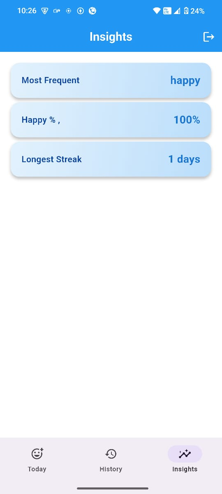

# 📱 Mood Tracker App

A Flutter + Firebase powered application that allows users to **log daily moods**, **add notes**, and **view mood history** with insightful analytics.  
Built using **Provider** for state management and Firebase for authentication & Firestore database.

---

## 🚀 Features

### 🔐 Authentication
- Login & Signup with email and password
- Form validation & custom snackbars
- Firebase Authentication integration

### 😊 Mood Logging
- Select mood for the day from multiple mood types
- Add optional notes
- Prevents multiple mood changes in a day

### 📜 Mood History
- Displays last 7 days of moods
- **Color-coded** mood entries for quick identification
- Edit notes for any past day without changing mood

### 📊 Insights
- Most frequent mood in the last week
- Happiness percentage
- Longest streak of same mood

---

## 🛠 Tech Stack

- **Flutter** (Dart)
- **Firebase Auth** (Login/Signup)
- **Cloud Firestore** (Mood storage)
- **Provider** (State management)
- **Intl package** (Date formatting)

---

## 📂 Project Structure
```
lib/
│
├── Model/
│   └── mood_entry.dart          # Mood model & enum
│
├── screens/
│   ├── auth/                    # Login & Signup screens
│   ├── providers/               # AuthProvider, MoodProvider
│   ├── Service/                  # Firebase service classes
│   ├── mood_log_screen.dart     # Log today’s mood
│   ├── mood_history_screen.dart # View and edit history
│   └── home_shell.dart          # App shell with navigation
│
├── firebase_options.dart        # Firebase config
└── main.dart                    # Entry point
```

---

## ⚙️ Setup Instructions

1. **Clone the repository**
   ```bash
   git clone https://github.com/your-username/mood-tracker.git
   cd mood-tracker
   ```

2. **Install dependencies**
   ```bash
   flutter pub get
   ```

3. **Firebase setup**
   - Create a Firebase project in the Firebase Console.
   - Enable **Email/Password Auth** in Firebase Authentication.
   - Create a **Cloud Firestore** database.
   - Download the `google-services.json` (Android) and `GoogleService-Info.plist` (iOS) files and place them in the respective folders.
   - Run:
     ```bash
     flutterfire configure
     ```

4. **Run the app**
   ```bash
   flutter run
   ```

---

## 🖼 Screenshots

| Sign In | Sign Up | Today's Mood |
|---------|---------|--------------|
|  |  |  |

| History | Insights |
|---------|----------|
|  |  |

---

## 🎥 Demo Video
[▶ Watch the Demo](https://drive.google.com/file/d/1h2jIGBSmhesJQF3vdP_UmqxzaY62EDVp/view?usp=sharing)

---

## 🔍 Logic & Trade-offs

- **State Management:** Provider is used for better scalability and cleaner UI logic separation.
- **Firestore Rules:** Secured with user-level access to ensure privacy.
- **Async Safety:** Safe `notifyListeners()` to prevent calling after `dispose()`.
- **Trade-off:** Real-time Firestore listeners could have been used for instant UI updates, but `load()` calls are simpler and more predictable for this project scope.

---

